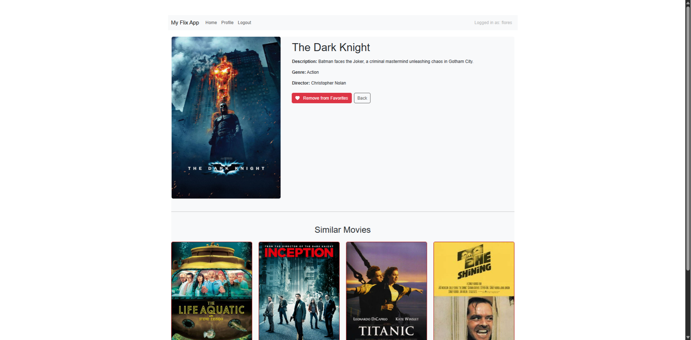

#Objective - Using React, build the client-side for an app called myFlix based on its existing server-side code (REST API and databases).
------------------------------------------------
MyFlix is a responsive React-base single-page application(SPA) for browsing movies, managing user profiles, and marking favorites.
It connects to an external API for user authentication and movie data.

Live Site: []  

Backend API:[] 

------------------------------------------------
Technologies Used in Project

- React
- React-Bootstrap
- React-Bootstrap
- React-Bootstrap-Icons
- React-Router
- React-Router-Dom
- Bootstrap
- Prop-Types

DevDependenices 
- @parcel/transformer-sass
- Parcel
-------------------------------------------------

#Getting started:
1. Create new repo on GitHub desktop --> new repo name: myFlix-client
2. Publish project make sure private code checkbox is unchecked to share.
3. Next in terminal run the following command npm init follow the prompts.
(this will result in a package.json file to be created.)
4. Make sure to open VS Code (editor of choice) and remove "main": "index.s" from package.json file.
5. Create a .gitignore file add the following:
node_modules
.cache
.parcel-cache
6. npm install -g parcel in terminal. 
7. Navigate to project folder and run the folloing command in terminal:
- npm install --save react react-dom (results in package-lock.json file)
8. Create src folder, then add the following 3 files in project.
- index.html
- index.jsx
- index.scss
Each one containg pieces of code to build the app.
9. Test project using parcel in your terminal run the following command:
- Make sure your within your project folder 
parcel src/index.html
This results in server running on http://localhost:1234
#Creating the following:
- A new Dist folder
with the following inside: 4 files will be rendered after completeing step 9.
- dist/index. css 
- dist/index. css.map
- dist/index. js
- dist /index. js.map

-----------------------------------------
##3.2 TASK - Building with JavaScript
- Create a new GitHub Branch off the main branch. 

Installing the following dependenices for project.

- npm install -g parcel
- npm install --save react react-dom

Create the following files and folder
- Create a src folder
- Create the following files that go inside src folder
- index.jsx & code

- index.scss & code
  
- index.html & code  
 

Create the README File in your project terminal
New-Item README.md

Results in this if the steps are done correctly

>[!Tip]
> To view your project navigate to project in terminal or powershell  
> cd careerfoundry  
> cd myFlix-client  
> parcel src/index.html  
> a windows or chrome screen will pop up containing URL http://localhost:1234  
------------------------------------------
##3.3 TASK - React components & Virtual DOM

- Create a new GitHub Branch off the main branch
- Create a new folder within src folder named "components"
- Create a new folder within components folder named "MainView"
- Create a new file within MainView folder named "main-view.jsx"
- npm install prop-types to your project 

File Structure should look like this
 - src 
 - components
 - MainView
    - main-view.jsx
 - index.html
 - index.jsx
 - index.scss
 - package.json

 
 

- Create new folder within components folder named "MovieCard 
- Create new file within MovieCard named "movie-card.jsx" 
- Add code 

- Create new folder within components folder name "MovieView"
- Create new file within MovieView named "movie-view.jsx"
- Add code 

- Take a look at my [CodeSandbox for Book App](https://codesandbox.io/p/sandbox/3-3-react-components-project-setup-forked-1-4wnhgr)
- Take a look at my demo here[CodeSandbox for myFlix-client App](https://codesandbox.io/p/sandbox/3-3-project-setup-for-myflix-final-task-2-)

---------------------------------------------
##3.4 TASK - React Lifecycle Methods

- Create a new GitHub Branch off the main branch
- npm install prop-types to your project.

- Refactor codes in main-view.jsx

- Take a look at my [CodeSandbox for Book App](https://codesandbox.io/p/sandbox/sweet-dream-6qzvwp)
- Take a look at my demo here [CodeSandbox for myFlix-client App](https://codesandbox.io/p/sandbox/elastic-bush-29x56h)

- Troubleshooting Cors

---------------------------------------------
##3.5 TASK - Create forms with React

- Create a new GitHub Branch off the main branch
- Create new components folders "LoginView" and "SignupView"
- Create new files "login-view.jsx" and "signup-view.jsx"

- Project Structure should now look like this 

- Take a look at my demo here [CodeSandbox for myFlix-client App](https://codesandbox.io/p/sandbox/elated-nova-scxvh8)
- Take a look at my demo here [CodeSandbox for Book App](https://codesandbox.io/p/sandbox/3-5-books-app-react-demo-forked-7-l4n9h7)

-----------------------------------------------
##3.6 TASK - React Bootstrap

- Create a new GitHub Branch off the main branch
- npm install react-bootstrap bootstrap
- Applying a responsive grid to your views using Bootstrap.
- Add container to your index.jsx file
- Add rows (Row) and columns (Col) to MainView.jsx
- Create movie-view.scss Add styling

- Refactor code in the following areas
 -main-view.jsx
 -index.jsx
 -index.scss
 -login-view.jsx
 -signup-view.jsx
 -movie-view.jsx
 -movie-view.scss (new file)

- Take a look at my demo here [CodeSandbox for myFlix-client App](https://codesandbox.io/p/sandbox/3-6-final-task-vldk7s)
- Take a look at my demo here [CodeSandbox for Book App](https://codesandbox.io/p/sandbox/delicate-cookies-kdl337)
- Adding style 
- Take a look at my demo here [CodeSandbox for Book App](https://codesandbox.io/p/sandbox/3-6-books-app-react-demo-8-nm46qx)

- Results from the task  

------------------------------------------------
##3.7 TASK - Client-Side App Routing

- Create a new GitHub Branch off the main branch
- npm install react-router
- npm install react-router-dom
- npm install react-bootstrap-icons

- Create new component folders "ProfileView" and "NavigationBar"
- Create new files "profile-view.jsx" and "navigation-bar.jsx"
- Create new files "movie-card.css

- Refactor code in the following areas:
main-view.jsx, movie-card.jsx, movie-view.jsx, movie-view.scss, signup-view.jsx, login-view.jsx, profile-view.jsx, navigation-bar.jsx

File Structure should now look like this 

- Take a look at my demo here [CodeSandbox for Books App](https://codesandbox.io/p/sandbox/3-7-routing-starting-repo-forked-hkfkqz)

------------------------------------------------
Results In the end:

